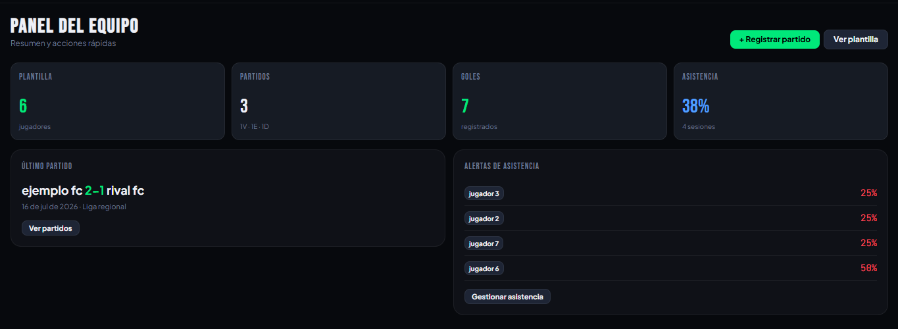
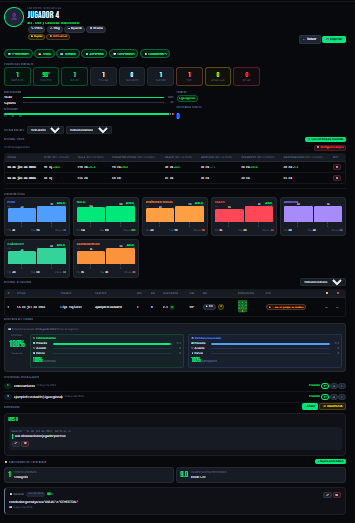
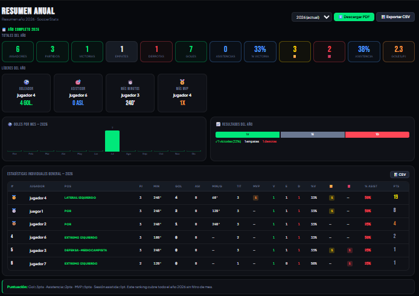
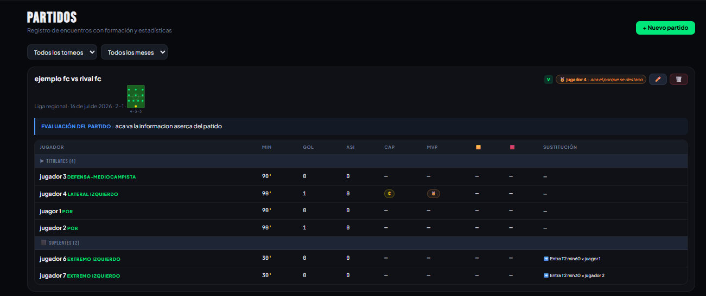
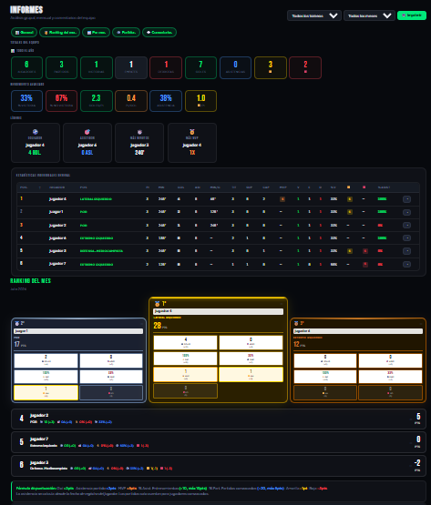
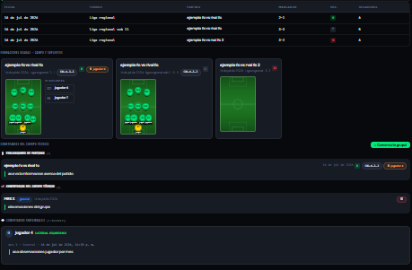
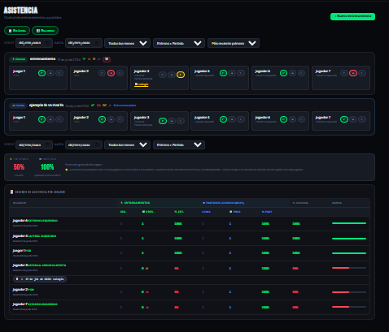
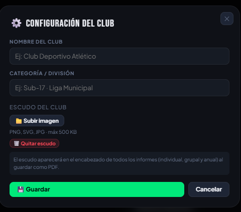

# 🌱 SEED Prototype

### Sistema Estadístico para Escuelas Deportivas

Primer prototipo funcional del sistema de gestión, seguimiento y análisis estadístico para escuelas deportivas.

**Desarrollado por Future Forge Technologies (FFT)**

---

# 📖 Descripción

**SEED (Sistema Estadístico para Escuelas Deportivas)** es una plataforma diseñada para centralizar la gestión administrativa y deportiva de escuelas de formación y clubes deportivos.

Este primer prototipo fue desarrollado utilizando **HTML, CSS y JavaScript**, con el objetivo de validar la idea y demostrar las funcionalidades principales del sistema.

La plataforma permite administrar jugadores, controlar asistencia, gestionar partidos, generar informes y visualizar estadísticas deportivas desde un único lugar.

Este repositorio representa el inicio del proyecto y servirá como base para el desarrollo de una versión profesional.

---

# 🎯 Objetivos

- Digitalizar la gestión de escuelas deportivas.
- Centralizar la información deportiva y administrativa.
- Facilitar el seguimiento del rendimiento de los jugadores.
- Mejorar la organización de entrenadores y coordinadores.
- Servir como base para la evolución de SEED hacia una plataforma completa.

---

## 🎨 Identidad visual

- ⏳ Logo: En desarrollo
- ⏳ Banner: En desarrollo
- 🎯 Objetivo: Crear una identidad visual profesional para SEED como producto de Future Forge Technologies. 

---

# ✨ Funcionalidades implementadas

- 📊 Dashboard interactivo
- 👥 Gestión de jugadores
- 👤 Perfil individual del jugador
- ⚽ Gestión de partidos
- 📅 Control de asistencia
- 📈 Estadísticas deportivas
- 📄 Generación de informes
- ⚙ Configuración del equipo

---

# 📸 Capturas del sistema

## Dashboard Principal

---

## Perfil del Jugador

---

## Resumen Anual

---

## Gestión de Partidos

---

## Informes

---

## Control de Asistencia

---

## Configuración

---

# 🛠 Tecnologías utilizadas

- HTML5
- CSS3
- JavaScript
- Chart.js
- LocalStorage

---

# 🚀 Próximas versiones

## Versión 2.0

- Frontend con Next.js
- Backend con Node.js + Express
- PostgreSQL
- Prisma ORM
- Firebase Authentication
- Gestión de múltiples escuelas deportivas
- Roles y permisos
- Sistema de pagos
- Aplicación móvil

---

# 👨‍💻 Autor

**Esteban Ramos**

Software Engineering Student of the University Politecnico Grancolombiano

Founder of **Future Forge Technologies**

---

# 📄 Licencia

Este repositorio corresponde al primer prototipo funcional de SEED y se publica con fines de demostración y portafolio.

© 2026 Future Forge Technologies. Todos los derechos reservados.
